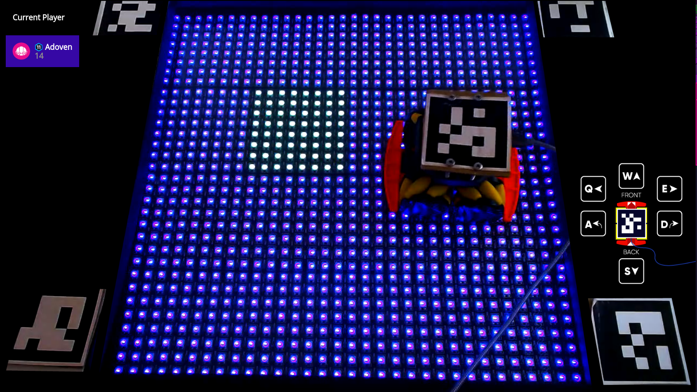

# Image recognition using aruco markers

On this page we will give a short explanation on how to use aruco marker
image recognition as part of your game. After reading this tutorial you will
know what aruco markers are, what they can be used for, and how to use them.

## Aruco markers: what are they

Aruco markers are black and white symbols designed to be easy to detect by
computers.
They can be printed on paper and placed in the physical world. The only data
stored in
the marker is its ID, which is just a number. Here's an example of
what an aruco marker looks like:


## How are they useful

With aruco markers, it's easy to implement tracking of objects and location
based logic into a game. For instance, we use aruco markers to generate a
virtual grid and track the movement of a robot inside that grid in our
[ColorCatcher game](https://www.surrogate.tv/game/colorcatcher).

Aruco markers can also be used to:

- Detect distance from object to camera
- Detect distance between two objects
- Detect when an object appears or disappears on the camera
- Implement checkpoints for a racing game
- A million other things!



## Sounds great! How do I use them

1. Generate some markers. Use your favorite search engine and look for
   "aruco generator".
   IMPORTANT: Use a 5x5 dictionary and IDs between 0-49 when creating the
   markers! How
   big the markers should be depends on how far away you wish to detect them.
   50-100 mm is a good starting point.
2. Print out the markers. (Or use a PC/phone/tablet screen if you just want to
   test things)
3. Use our aruco system in your game code. Perhaps the easiest way is to use
   the [ArucoFinder](modules/surrortg.image_recognition.aruco.html#module-surrortg.image_recognition.aruco.aruco_finder)
   class. Here's an example:

```python
from surrortg.image_recognition.aruco import ArucoFinder

YourGame(Game):
    async def on_init(self):
        self.finder = await ArucoFinder.create(self.io)

    async def on_config(self):
        self.finder.on_config(self.configs)

    async def on_start(self):
        self.finder.on_start()
```

The above code will, by default, look for markers with IDs from 0 to 4, and end
the game once all have been found. The behavior of the ArucoFinder can be
configured in the Game
Engine page of the settings page on the game dashboard. There you can change
the number
of markers, number of laps, minimum distance, and whether the markers must be
found in
numerical order. For a racing game, set in_order to True, and increase the
number of laps.

### A deeper dive into aruco detection

Right now the aruco detection features are still a work in progress. If you
want to see
a working example, check out the
[source code for our ColorCatcher game](https://github.com/SurrogateInc/surrortg-sdk/tree/main/games/color_catcher)
. There is also the easy-to-use ArucoFinder class that can be used to integrate
treasure hunt and racing game logic into a game with only a few lines of code.
Of course, it's always possible to code your own logic for aruco markers using
our SDK. Check out the
[aruco section](modules/surrortg.image_recognition.aruco.html#surrortg-image-recognition-aruco)
in our Python SDK reference to see how the sausage is made.

Links to relevant reference pages:

- [ArucoDetector](modules/surrortg.image_recognition.aruco.html#surrortg.image_recognition.aruco.aruco_source.ArucoDetector)
  , the base class for aruco detection. Just create one of these, and subscribe
  a method to receive aruco markers as they are found.
- [ArucoMarker](modules/surrortg.image_recognition.aruco.html#module-surrortg.image_recognition.aruco.aruco_marker)
   , represents an aruco marker which has been found. These are used to pass
   around detected markers within the code.
- [ArucoFinder](modules/surrortg.image_recognition.aruco.html#module-surrortg.image_recognition.aruco.aruco_finder)
  , a simple to use class which includes everything that's needed for a treasure
  hunt or racing game with aruco markers.
- [ArucoGrid](modules/surrortg.image_recognition.aruco.html#surrortg.image_recognition.aruco.virtual_grid.ArucoGrid)
   , the class we use to create the virtual grid for ColorCatcher. Can be used
   for any other game as well!
- [ArucoFilter](modules/surrortg.image_recognition.aruco.html#module-surrortg.image_recognition.aruco.aruco_filter)
  , a helper class to filter aruco detections based on ID, distance, or time
  interval. You can also add your own filters on top of the defaults.